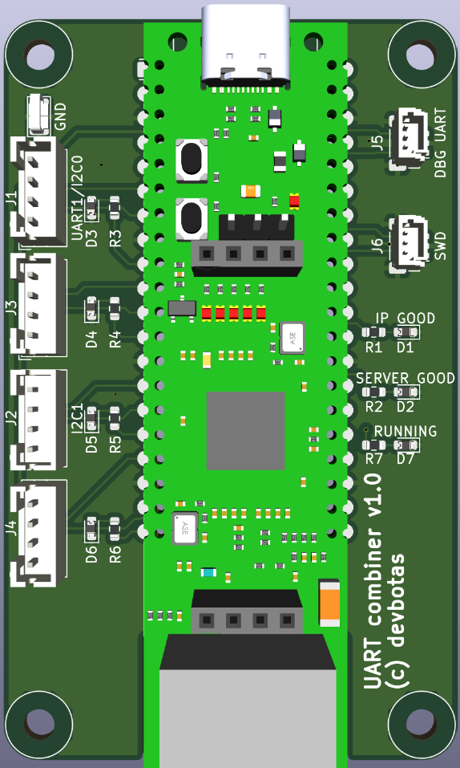
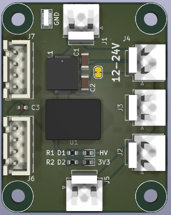
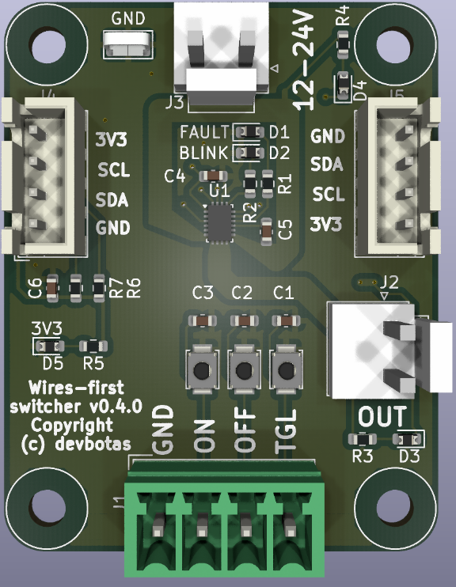
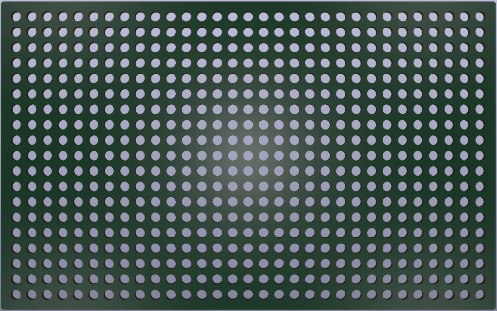

# The Problem

Wireless IoT sucks.

It's unreliable and breaks all the time. There's not such thing as reliable, maintenance-free, wireless IoT.

If it runs on batteries - that's even worse.

Another problem - central IoT hubs. If those break, lose connection, decides to reboot ar whatever - my smart house immediatelly becomes non-functional.

# The Solution

Put the analog wires first! So that light switches continue to operate even if smart features decide to stop working.

# The Boards

## Gateway

This is a simple carrier board for WizNET W55RP20 development module. It cannot do much by itself - maybe blink some LEDs. Real functionality (and also power) should come from the JST PH headers.

Can be mounted on M or L size Holey board.

## Voltage converter

Takes 12-24V input (technically, 5-70V, but these voltages may not be supported on the other modules that this one is supposed to power) and creates 3.3V output so Gateway or other low power modules could be connected through the JST XH connector. Additionally, there are multiple JST VH connectors, which act as a power switch to connect multiple power hungry modules, like the Switcher.

Two can be mounted on a single Holey-S board.

## Switcher

Originally meant to control LED lights, but it can switch anything. It has one switchable 12/24V output (should be able to handle 4A). Output can be controlled simultaneously in multiple ways:

* ON wire: shorting this to GND for 100ms will turn the switch on.
* OFF wire: shorting this to GND for 100ms will turn the switch off.
* TGL wire: shorting this to GND for 100ms will toggle the switch.
* I2C directly: software based commands that can turn switch on or off and read the current state.

The idea here that ON/OFF/TGL signals could be wired to the physical wall switches directly, any smart features being entirely optional. So the switch will operate as a dumb-switch.

Renesas HVPAK SLG47115 chip serves both as a high-power switch and an input sanitizer. For example, if faulty hardware shorts ON signal to GND permanently, OFF and TGL signals continue to operate normally. 

Two can be mounted on a single Holey-S board.

## Holey boards

These are very handy to mount modules listed above, or maybe anything. They have a grid of 3.2mm diameter holes (hence the name) on a 5mm grid. They work perfectly with any M3 mounting hardware and come in the following sizes:

* L - 160x100 mm
* M - 100x80 mm
* S - 80x40 mm

So, one M board can fit exactly two S boards, and one L board can fit exactly 2 M boards. This allows some neat and functional arrangement.
