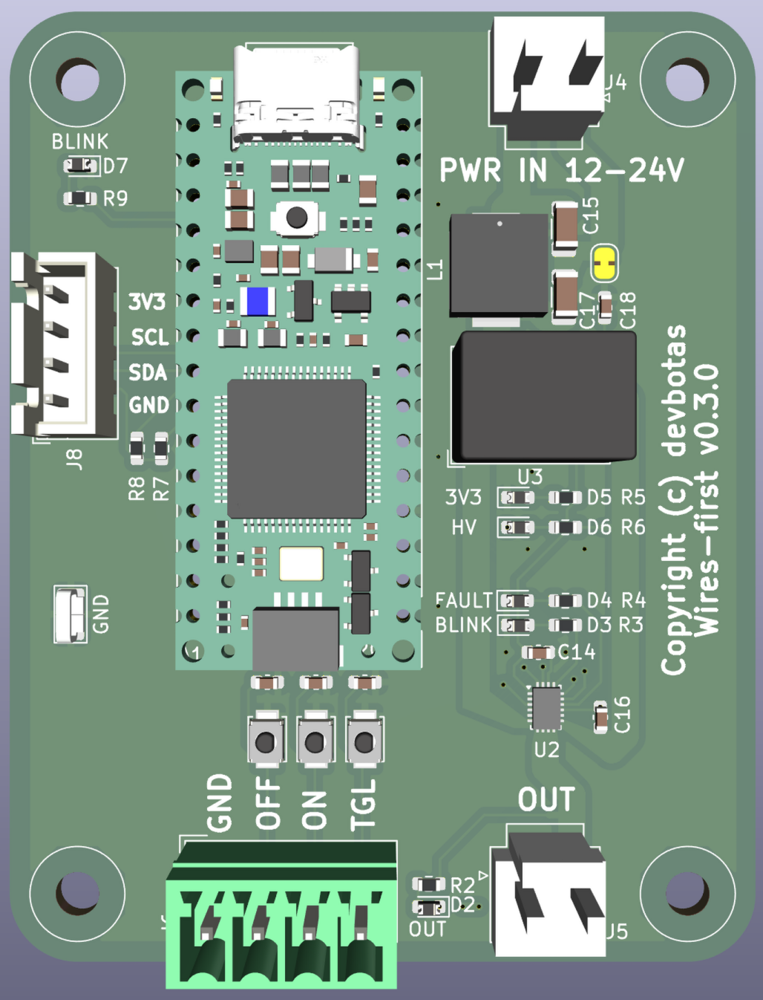

# The Problem

Wireless IoT sucks.

It's unreliable and breaks all the time. There's not such thing as reliable, maintenance-free, wireless IoT.

If it runs on batteries - that's even worse.

Another problem - central IoT hubs. If those break, lose connection, decides to reboot ar whatever - my smart house immediatelly becomes non-functional.

# The Solution

Put the analog wires first! So that light switches continue to operate even if smart features decide to stop working.

# The Boards

## Gateway

This is a simple carrier board for WizNET W55RP20 development module. It cannot do much by itself - maybe blink some LEDs. Real functionality (and also power) should come from the JST PH headers.

## Switcher

This is a draft for a lights controller.

It has one switchable 12/24V output (should be able to handle 4A). Output can be controlled simultaneously in multiple ways:

* ON wire: shorting this to GND for 100ms will turn the switch on.
* OFF wire: shorting this to GND for 100ms will turn the switch off.
* TGL wire: shorting this to GND for 100ms will toggle the switch.
* Arduino or I2C directly: software based commands that can turn switch on or off and read the current state.

The idea here that ON/OFF/TGL signals could be wired to the physical wall switches directly, Arduino being entirely optional. So the switch will operate as a dumb-switch.

Renesas HVPAK SLG47115 chip serves both as a high-power switch and an input sanitizer. For example, if faulty hardware shorts ON signal to GND permanently, OFF and TGL signals continue to operate normally. 

To make the thing smart (and still retain the "dumb" functionality), Arduino Nano ESP32 should be plugged in. Preferrable path is to install Matter-compatible firmware, thus making this device instantly recognized by any Matter controller. But one can write custom FW is desired.
