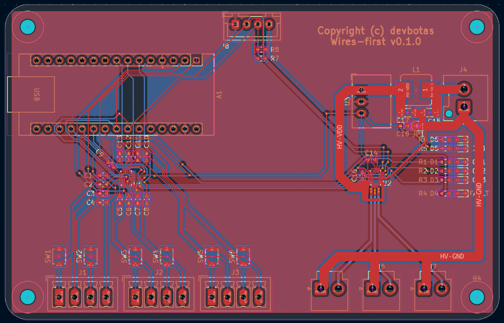

# The Problem

Wireless IoT sucks.

It's unreliable and breaks all the time. There's not such thing as reliable, maintenance-free, wireless IoT.

If it runs on batteries - that's even worse.

Another problem - central IoT hubs. If those break, lose connection, decides to reboot ar whatever - my smart house immediatelly becomes non-functional.

# The Solution

Put the analog wires first! So that light switches continue to operate even if smart features decide to stop working.

# The Board

This is a draft for a lights controller.

Every output has four inputs: two ONs and two OFFs. Initial idea is to use one pair for physical switch, and one pair for the Arduino software-based control, but technically they are identical. I'm using Renesas GreenPAK SPLDs to ensure deadlock-free operation, in case the are conflicting inputs.
